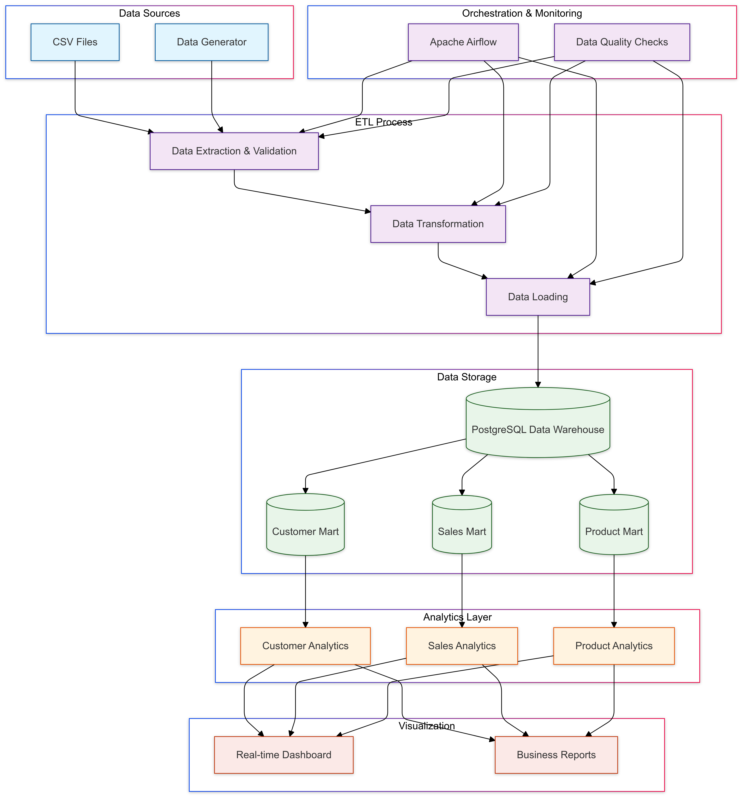

# E-commerce Customer Behavior and Sales Analytics Platform

> Final Project Data Engineer Bootcamp - End-to-end ETL Pipeline untuk Analisis Perilaku Pelanggan dan Penjualan E-commerce

## Overview Project

Project ini bertujuan membangun sistem ETL end-to-end untuk mengolah dan menganalisis data perilaku pelanggan dan penjualan dari sebuah platform e-commerce. Sistem ini membantu tim bisnis dan marketing mendapatkan insight yang berguna untuk meningkatkan penjualan dan pengalaman pelanggan.

### Masalah yang Diselesaikan
1. Tim Marketing sulit mengidentifikasi efektivitas promosi
2. Tim Produk kesulitan memahami perilaku pelanggan di aplikasi
3. Tim Bisnis butuh data real-time untuk pengambilan keputusan
4. Tim Inventory sulit memprediksi stok berdasarkan tren musiman

## Arsitektur Sistem



## Dataset

Dataset berisi data transaksional aktivitas e-commerce termasuk pemesanan produk dan perilaku pelanggan dalam menggunakan aplikasi. Dataset terdiri dari 4 file CSV:

- click_stream.csv (12.8 juta baris)
- customer.csv (100 ribu baris)
- product.csv (44 ribu baris)
- transactions.csv (852 ribu baris)

[Link Dataset](masukkan_link_gdrive_disini)

## Tech Stack

- **Data Processing**: Python (pandas, numpy)
- **Data Warehouse**: PostgreSQL
- **Orchestration**: Apache Airflow
- **Processing Engine**: Apache Spark
- **Containerization**: Docker & Docker Compose
- **Visualization**: Streamlit
- **Testing**: Python unittest

## Struktur Project
```
ecommerce_analytics/
├── airflow/                    # Konfigurasi dan DAGs Airflow
├── src/                       # Source code untuk ETL
├── tests/                    # Unit tests
├── dashboards/              # Streamlit dashboards
├── config/                  # File konfigurasi
├── docker/                  # Dockerfile dan related files
├── docs/                    # Dokumentasi
└── assets/                  # Gambar dan media
```

## Features

1. **Data Extraction & Validation**
   - Membaca data dari multiple CSV files
   - Validasi struktur dan konten data
   - Handling data dalam chunks untuk file besar

2. **Data Transformation**
   - Cleaning dan standardisasi data
   - Derivasi feature baru
   - Data type conversion
   - Handling missing values

3. **Data Loading**
   - Loading ke PostgreSQL data warehouse
   - Implementasi fact dan dimension tables
   - Referential integrity checks

4. **Orchestration & Monitoring**
   - Automated workflow dengan Airflow
   - Data quality checks
   - Error handling dan logging

## Cara Menjalankan Project

### Prerequisites
- Docker dan Docker Compose
- Python 3.9+
- Git

### Setup Instructions

1. Clone repository
```bash
git clone https://github.com/username/ecommerce-etl-pipeline.git
cd ecommerce-etl-pipeline
```

2. Setup environment
```bash
python -m venv venv
source venv/bin/activate  # Linux/Mac
.\venv\Scripts\activate   # Windows
pip install -r requirements.txt
```

3. Download dataset
- Download dataset dari [link](masukkan_link_gdrive_disini)
- Extract ke folder `data/raw/`

4. Jalankan docker containers
```bash
docker-compose up -d
```

5. Run ETL pipeline
```bash
python tests/test_etl.py
```

## Links

- [Project Presentation](masukkan_link_ppt_disini)
- [Project Documentation](docs/architecture.md)
- [Data Dictionary](docs/data_dictionary.md)

## Pengembangan Selanjutnya

1. Implementasi real-time data processing dengan Kafka
2. Penambahan automated testing
3. Optimasi query dan indexing
4. Pengembangan dashboard lebih lanjut
5. Implementasi machine learning pipeline